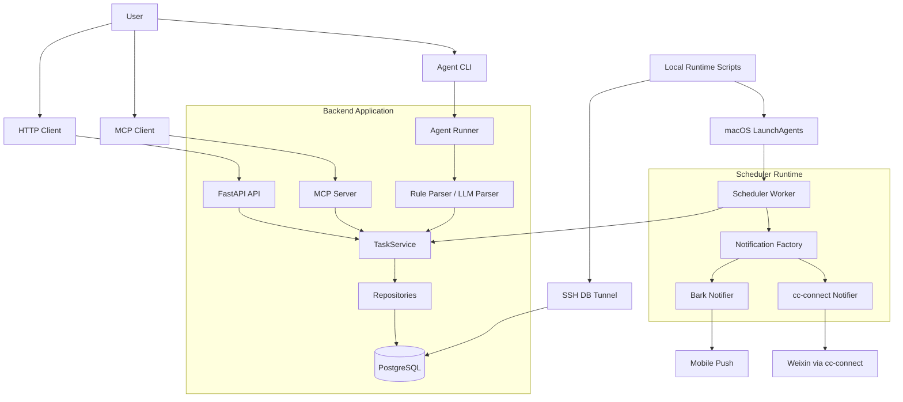
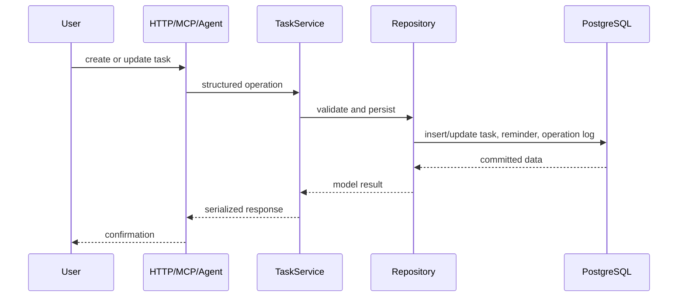
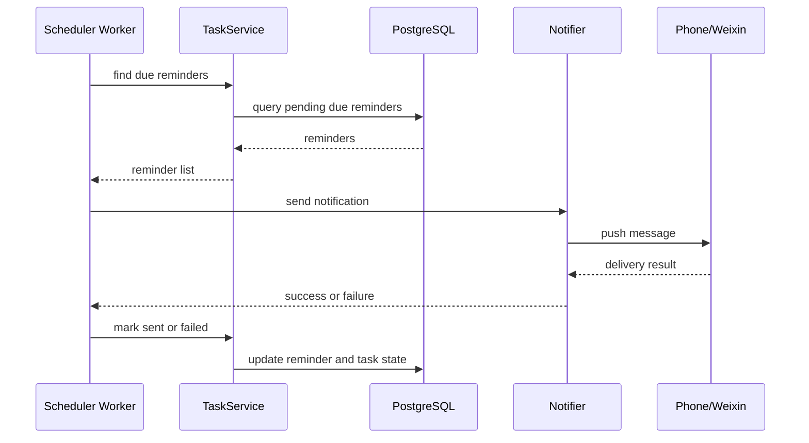

# Architecture

This document describes the current architecture of `time-management-assistant`.
The system is a personal time-management assistant with HTTP, MCP, CLI, scheduler,
and notification entry points over the same task and reminder data model.

## Overview



## Module Responsibilities

### Entry Points

| Entry point | Responsibility | Must not do |
| --- | --- | --- |
| HTTP API | Expose task, reminder, summary, and health endpoints. | Bypass `TaskService` for business changes. |
| MCP Server | Expose assistant tools to MCP-compatible clients. | Send real reminder notifications. |
| Agent CLI | Parse local natural-language commands and run structured operations. | Invent task data or skip required clarification. |
| Scheduler | Scan due reminders and send real notifications. | Own unrelated task business rules. |
| Scripts | Manage local runtime helpers such as SSH tunnel and launchd. | Become a second business layer. |

### Backend

`backend/app` owns the FastAPI application, database configuration, ORM models,
repositories, schemas, and business services.

- `backend/app/main.py`: creates the FastAPI app and mounts API routers.
- `backend/app/api`: HTTP endpoints for tasks, reminders, summaries, and health checks.
- `backend/app/models`: SQLAlchemy models and enums for tasks, reminders, and operation logs.
- `backend/app/repositories`: database access methods.
- `backend/app/services/task_service.py`: task and reminder business logic.
- `backend/app/database.py`: SQLAlchemy engine and session setup.
- `backend/app/config.py`: environment-driven runtime configuration.

The service layer is the shared path for state changes. API, MCP, Agent, and
Scheduler code should use it instead of writing database records directly.

### Scheduler

`scheduler/worker.py` is the only component that sends real reminder
notifications. It scans due reminders, sends through the configured notification
channels, and then updates reminder state.

- success: mark reminder as `sent`, set `sent_at`, and mark the related task as reminded.
- failure: mark reminder as `failed` with `error_message`; the related task remains unreminded.
- already `sent` or `failed` reminders are skipped.

HTTP, MCP, and Agent `check_reminders` paths keep mock behavior and must not send
real notifications.

### Notifications

`notifications` contains the outbound notification layer.

- `base.py`: common notifier interface and send result type.
- `bark.py`: Bark HTTP push implementation.
- `cc_connect.py`: local `cc-connect send` implementation.
- `factory.py`: creates enabled notifiers from environment variables.

`NOTIFICATION_ENABLED=false` is the safe default. Real sends require explicit
configuration and local secrets in `backend/.env`, which is ignored by Git.

### MCP Server

`mcp_server/server.py` exposes the assistant tools to MCP-compatible clients.
It is an integration layer over the backend service behavior, not a separate
business logic implementation.

### Agent CLI

`agent` contains the local natural-language command path.

- `parser.py`: deterministic rule-based parsing.
- `llm_parser.py`: LLM-assisted parsing.
- `runner.py`: maps parsed intents to backend operations.
- `cli.py`: command-line entry point.

The Agent follows `AGENTS.md`: query before ambiguous updates, confirm deletes,
use local timezone, and avoid inventing task data.

### Runtime Scripts

`scripts` contains local operational helpers.

- `doctor.py`: checks local runtime readiness without modifying data or sending notifications.
- `db_tunnel.py`: starts, checks, and stops the SSH tunnel to remote PostgreSQL.
- `launchd.py`: installs and manages macOS LaunchAgents for the tunnel and scheduler.

Tunnel details, database passwords, Bark keys, and cc-connect local credentials
belong in local ignored files only.

## Data Ownership

| Data or configuration | Owner | Notes |
| --- | --- | --- |
| `tasks` | `TaskService` | Core task lifecycle and status changes. |
| `reminders` | `TaskService` and Scheduler | Service creates and queries reminders; Scheduler only writes delivery state. |
| `operation_logs` | Service layer | Records business modifications made through supported entry points. |
| `backend/.env` | Local runtime | Ignored by Git; stores database, tunnel, and notification settings. |
| SSH tunnel | `scripts/db_tunnel.py` | Provides local access to private remote PostgreSQL. |
| launchd plists | `scripts/launchd.py` | Generated local process configuration. |
| notification secrets | Local runtime | Bark keys, cc-connect settings, and passwords must not be committed. |

## Runtime Doctor

Use the doctor script when the local runtime behaves unexpectedly:

```bash
python time-management-assistant/scripts/doctor.py
```

It checks the local `.env`, database tunnel reachability, PostgreSQL connection,
notification configuration, scheduler importability, and launchd service state.
The script does not modify database records and does not send notifications.

## Data Flow

### Create Or Update A Task



### Send A Reminder



## External Integrations

- PostgreSQL is the source of truth for tasks, reminders, and operation logs.
- Bark can deliver mobile push notifications when configured.
- cc-connect can deliver Weixin messages through the local `cc-connect` project.
- macOS launchd can keep the SSH tunnel and scheduler running locally.

The separate local `schedule` project can also use cc-connect, but it is not part
of this repository's core data model.
